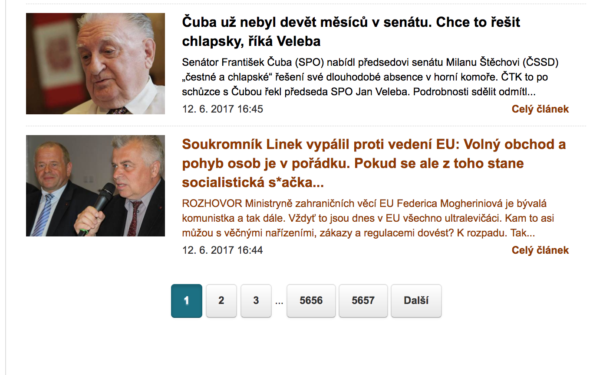

## Parlamentnilisty.cz scraper

### Description

This scraper creates a .csv file with all articles published on the parlamentnilisty.cz. The scraper works in the following way:

1. The scraper extracts the number of pages in the section of articles by looking at the number of last page (see the picture below). 

2. Then, the scraper crawls on every available page and extracts the title of the article, URL link to the full article, and the date of publishment (see the picture below with the layout of the page, the scraper extracts the content on the left).

3. The resulting list is saved to csv.